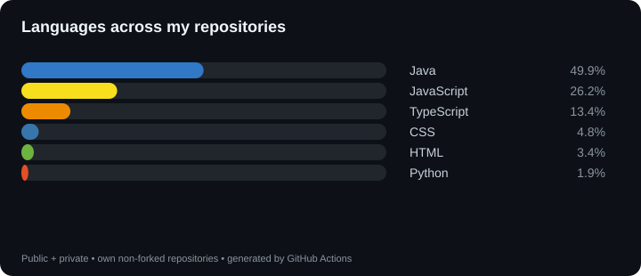

Hi, I’m João Victor Ribeiro 👋

Backend developer focused on Java and Python. Currently pursuing a Software Engineering degree and building applications with Java, Spring Boot, Python and modern web technologies.

I enjoy building things that solve real operational problems — from automation scripts to full applications and REST APIs. Always looking for the next thing to learn and ship.

⸻

🛠️ Tech Stack

  

⸻

📊 GitHub Languages

  

⸻

📚 Education & Learning

* ✅ Java Fullstack Bootcamp — Generation Brasil · Completed September 2026
* ⚡ AI Java Back-end — Santander Open Academy / DIO
* 🎓 Software Engineering — UNINTER

⸻

🚀 Projects

🏦 Conta Bancária

Java application focused on Object-Oriented Programming, simulating a banking system with account management and financial transactions.

Java OOP Inheritance Polymorphism Interfaces

Features:

* Account creation and management
* Deposits and withdrawals
* Transfers between accounts
* Current and savings accounts
* Account search and CRUD operations

⸻

💊 Farmácia API REST

RESTful API for pharmacy inventory and sales management, developed during the Generation Brasil Java Full Stack Bootcamp.

Built with a layered architecture and deployed to production.

Java Spring Boot Spring Security JWT PostgreSQL JPA Hibernate JUnit Swagger Render

Features:

* JWT authentication and authorization
* User management
* Product CRUD
* Category CRUD
* Inventory management
* Protected REST endpoints
* PostgreSQL persistence
* Swagger/OpenAPI documentation
* Production deployment on Render

🔗 Live API · Swagger

⸻

☀️ BitWeather

Interactive weather application with a retro 8-bit / Pixel Art interface.

Consumes the Open-Meteo API for geocoding, current weather conditions and weekly forecasts.

JavaScript HTML5 CSS3 REST API Jest

Features:

* City search and geocoding
* Current weather conditions
* Weekly forecast
* Dynamic day/night/rain interface
* Weather metrics and icons
* API error handling
* Automated tests with Jest

⸻

🎮 sudoku.jribeiro.me

Full Sudoku game built and deployed in production.

Next.js React JavaScript Tailwind CSS

⸻

🧾 Tax Automation — Kont.

Python scripts developed to automate accounting routines and fiscal processes.

Python Automation

⸻

📬 Contact

  
  
  

